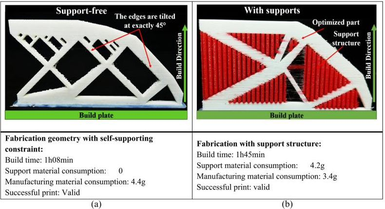

<section class="theory" markdown="1">

## Теоретические сведения
{: .section__title}

Слайсер показывает оценку времени печати и расхода материала, но откуда берутся эти числа? Из самого G-кода: в нём записаны все слои, все отрезки и вся подача нити. Значит, эти показатели можно посчитать самостоятельно — и проверить слайсер.

Такой анализ — обычная часть производства. Программы управления аддитивным производством принимают G-код, показывают сгенерированные команды и послойную разбивку скорости построения, чтобы перед запуском проверить, что файл печатаем. Типичная деталь состоит из тысяч слоёв с собственными траекториями, и вручную проверить их невозможно.

</section>

<section class="goal" markdown="1">

## 🎯 Цель работы
{: .section__title}

Научиться:

- извлекать из G-кода число слоёв, длину нити, массу материала и длину путей;
- учитывать режимы координат и подачи при разборе файла;
- оценивать время печати и объяснять, почему оценка расходится с оценкой слайсера;
- сравнивать варианты нарезки одной модели по данным G-кода.

</section>

<aside class="callout callout--hint" markdown="1">

⏱ Время и место выполнения
{: .callout__title}

Задания этой страницы рассчитаны примерно на 15 минут и выполняются в аудитории. Итоговое задание можно закончить дома.

</aside>

<aside class="callout callout--important" markdown="1">

Если слайсер не установлен
{: .callout__title}

Для итогового задания нужен слайсер: PrusaSlicer, UltiMaker Cura или [Kiri:Moto](https://grid.space/kiri/), который работает прямо в браузере <span class="tag tag--ext">вне источников</span>. Если ни один из них недоступен, сравнивайте файлы `square_20.gcode` и `square_80.gcode` из [task 1-4](task_1-4.html).

</aside>

<!-- ===================== 1 ===================== -->

<section class="subsection" id="s1" markdown="1">

## <span class="subsection__num">1.</span> Что можно извлечь из G-кода
{: .subsection__title}

| Показатель | Как считается | Что нужно учесть |
|---|---|---|
| число слоёв | число разных значений Z у рабочих ходов | подъёмы без печати слоем не считаются |
| длина нити | сумма приращений `E` у рабочих ходов | режимы `M82` / `M83`, обнуление `G92 E0` |
| масса | длина нити · сечение нити · плотность | единицы: мм³ → см³ → г |
| путь печати | сумма длин рабочих ходов в плоскости XY | координаты при `G90` / `G91` |
| холостые ходы | сумма длин перемещений без подачи | `G28` возвращает оси в ноль |

<div class="definition" markdown="1">

<span class="definition__term">Модальное значение</span> — параметр, который действует, пока его не изменят. В G-коде модальны режимы (`G90`, `M83` и другие), скорость `F` и координаты: строка без `X` оставляет сопло на прежнем X.

</div>

Масса материала — это объём поданной нити, умноженный на плотность. Для PLA в примерах используется плотность 1,24 г/см³ из техлиста Prusament PLA <span class="tag tag--ext">вне источников</span>.

</section>

<!-- ===================== 2 ===================== -->

<section class="subsection" id="s2" markdown="1">

## <span class="subsection__num">2.</span> Разбор программы статистики
{: .subsection__title}

- [stats.py](../assets/files/stats.py){: .files__link}
{: .files}

<article class="example" markdown="1">

### Пример 1. Статистика файла G-кода
{: .example__title}

Файл `stats.py`:

```python
import math

def gcode_stats(path, d_fil=1.75, rho=1.24):    # rho — плотность PLA, г/см³ [вне источников]
    rel_xyz, rel_e = False, False
    x = y = z = e = 0.0
    e_sum = ext_len = trav_len = 0.0
    zs = set()
    for raw in open(path, encoding="utf-8", errors="ignore"):
        s = raw.split(";", 1)[0].strip()        # отрезаем комментарий
        if not s:
            continue
        words = s.split()
        cmd, a = words[0].upper(), {}
        for w in words[1:]:
            try:
                a[w[0].upper()] = float(w[1:])
            except ValueError:
                pass
        if cmd == "G90":   rel_xyz, rel_e = False, False
        elif cmd == "G91": rel_xyz, rel_e = True, True   # Marlin: G91 касается и E
        elif cmd == "M82": rel_e = False
        elif cmd == "M83": rel_e = True
        elif cmd == "G92":
            x, y, z, e = a.get("X", x), a.get("Y", y), a.get("Z", z), a.get("E", e)
        elif cmd == "G28":
            x = y = z = 0.0
        elif cmd in ("G0", "G1"):
            if rel_xyz:
                nx, ny, nz = x + a.get("X", 0), y + a.get("Y", 0), z + a.get("Z", 0)
            else:
                nx, ny, nz = a.get("X", x), a.get("Y", y), a.get("Z", z)
            de = 0.0
            if "E" in a:
                de = a["E"] if rel_e else a["E"] - e
                e = e + a["E"] if rel_e else a["E"]
            L = math.hypot(nx - x, ny - y)
            if de > 0 and L > 0:
                e_sum += de; ext_len += L; zs.add(round(nz, 3))
            elif L > 0:
                trav_len += L
            x, y, z = nx, ny, nz
    mass = e_sum * math.pi * (d_fil / 2) ** 2 / 1000 * rho   # мм³ → см³ → г
    return {"слоёв": len(zs), "нить, мм": round(e_sum, 1), "масса, г": round(mass, 2),
            "путь печати, м": round(ext_len / 1000, 2), "холостые, м": round(trav_len / 1000, 2)}

if __name__ == "__main__":
    import sys
    for p in sys.argv[1:]:
        print(p, gcode_stats(p))
```

```text
> @@python stats.py square.gcode scaffold.gcode@@
square.gcode {'слоёв': 10, 'нить, мм': 89.9, 'масса, г': 0.27, 'путь печати, м': 2.7, 'холостые, м': 0.62}
scaffold.gcode {'слоёв': 20, 'нить, мм': 59.9, 'масса, г': 0.18, 'путь печати, м': 1.8, 'холостые, м': 0.59}
```
{: .output}

<div class="analysis" markdown="1">

Разбор
{: .analysis__title}

- Комментарий отрезается до разбора: `raw.split(";", 1)[0]`. Каждое слово строки после команды превращается в пару «буква — число» словаря `a`.
- Флаги `rel_xyz` и `rel_e` хранят режимы. `G90` и `G91` переключают оба флага, `M82` и `M83` — только подачу. `G92` присваивает текущей позиции значение, `G28` возвращает оси в ноль.
- Для `G0` и `G1` вычисляются новая позиция и приращение подачи `de`: в относительном режиме это само число после `E`, в абсолютном — разность с предыдущим значением.
- Отрезок с положительной подачей и ненулевой длиной — рабочий ход: его длина и подача суммируются, высота Z попадает в множество `zs`. Остальные перемещения в плоскости — холостые.
- Втягивание и возврат нити перед холостым ходом происходят без движения по XY и в статистику не попадают.
- Масса: длина нити, умноженная на площадь сечения нити, даёт объём в мм³; деление на 1000 переводит его в см³.
- Числа совпадают со статистикой встроенного просмотрщика: он считает по тем же правилам.

</div>

</article>

<article class="task" id="task-1" markdown="1">

### Задание 1. Таблица по двум файлам <span class="level level--2">Уровень 2 · понимание</span>
{: .task__title}

Файл: <span class="task__file">task\_1-6\_1.py</span>
{: .task__meta}

Импортируйте `gcode_stats` из `stats.py` и выведите таблицу для файлов `square.gcode` и `scaffold.gcode` из [task 1-4](task_1-4.html):

```text
файл             слоёв  нить, мм  масса, г
square.gcode        10      89.9      0.27
scaffold.gcode      20      59.9      0.18
```
{: .output data-label="Требуемый вывод"}

Столбцы выровнены f-строками с шириной поля: 16, 6, 10 и 10 символов.

</article>

<article class="task" id="task-2" markdown="1">

### Задание 2. Оценка времени <span class="level level--3">Уровень 3 · применение</span>
{: .task__title}

Файл: <span class="task__file">task\_1-6\_2.py</span>
{: .task__meta}

Напишите функцию `print_time(path)`, которая оценивает время перемещений: для каждого отрезка `G0` или `G1` с ненулевой длиной в плоскости XY время равно длине, делённой на скорость. Скорость `F` модальна и задана в мм/мин ([task 1-1](task_1-1.html), раздел 4).

```text
square.gcode: 1.8 мин без учёта разгона и торможения
scaffold.gcode: 1.1 мин без учёта разгона и торможения
```
{: .output data-label="Требуемый вывод"}

В конце файла ответьте комментарием: почему реальная печать займёт больше времени, чем эта оценка. Подсказка: что происходит с головкой, когда она поворачивает под прямым углом, и что делает принтер, выполняя `M190` и `M109`?

</article>

</section>

<!-- ===================== 3 ===================== -->

<section class="subsection" id="s3" markdown="1">

## <span class="subsection__num">3.</span> Как это выглядит в реальном эксперименте
{: .subsection__title}

В исследовании Antar et al. (2026) консольную балку, спроектированную методом топологической оптимизации, напечатали двумя способами: в самоподдерживающейся форме с рёбрами под 45° и в исходной форме с поддержками. Обе детали печатались методом FDM из PLA с одинаковыми параметрами; G-код получен из STL-файлов слайсером IdeaMaker.

<figure class="figure-src">

<figcaption class="figure-src__caption">(a) Без поддержек: 1 ч 08 мин, 4,4 г материала. (b) С поддержками: 1 ч 45 мин, 4,2 г поддержек и 3,4 г детали.<br>Источник: Antar I. et al., Int. J. Adv. Manuf. Technol., 2026, 143:163–182, Fig. 15, p. 177.</figcaption>
</figure>

<div class="analysis" markdown="1">

Разбор
{: .analysis__title}

- Без поддержек печать заняла на 37 минут меньше — это 35 % от времени печати с поддержками.
- В варианте с поддержками больше половины материала — 4,2 г из 7,6 г — уходит в поддержки, которые затем удаляют.
- Всё это можно было узнать до печати, из G-кода двух вариантов: именно так вы сравните свои варианты в итоговом задании.

</div>

</section>

<!-- ===================== 4 ===================== -->

<section class="subsection" id="s4" markdown="1">

## <span class="subsection__num">4.</span> Просмотрщик
{: .subsection__title}

Откройте свои файлы кнопкой «Открыть файл…». Статистика под картинкой должна совпасть с результатом `stats.py`.



</section>

<!-- ===================== ИТОГОВОЕ ===================== -->

<section class="final-task" id="final" markdown="1">

## Итоговое задание: два варианта одной модели <span class="level level--5">Уровень 5 · итоговое</span>

Файлы: <span class="task__file">variant\_a.gcode</span>, <span class="task__file">variant\_b.gcode</span>, <span class="task__file">task\_1-6\_compare.py</span>, <span class="task__file">task\_1-6\_report.txt</span>
{: .task__meta}

**Ситуация.** Нужно решить, как печатать деталь: с поддержками или без них (либо с заполнением 20 % или 80 %). Решение принимается до печати, по данным G-кода.

**Требования:**

1. Нарежьте в слайсере одну и ту же модель в двух вариантах и сохраните файлы `variant_a.gcode` и `variant_b.gcode`. Запишите оценку времени и материала, которую показывает слайсер.
1. Программа <span class="task__file">task\_1-6\_compare.py</span> выводит для обоих файлов число слоёв, длину нити, массу, путь печати, холостые ходы и оценку времени из задания 2, а также отношение масс варианта Б к варианту А.
1. Откройте оба файла в просмотрщике и убедитесь, что статистика совпадает с выводом программы.
1. В файле <span class="task__file">task\_1-6\_report.txt</span> ответьте: какой вариант быстрее и экономнее и на сколько процентов; насколько ваша оценка времени отличается от оценки слайсера и почему; согласуется ли ваш результат с экспериментом Antar et al. (раздел 3).

</section>

<!-- ===================== ЗАТЕМ ===================== -->

<section class="then" markdown="1">

## Затем
{: .then__title}

1. Внутри папки `pipeline_1` создайте папку `task_1_6`.
1. Переместите в неё копию `stats.py`, программы и файлы этой страницы: <span class="task__file">task\_1-6\_1.py</span>, <span class="task__file">task\_1-6\_2.py</span>, <span class="task__file">task\_1-6\_compare.py</span>, <span class="task__file">task\_1-6\_report.txt</span>, <span class="task__file">variant\_a.gcode</span> и <span class="task__file">variant\_b.gcode</span>.
{: .steps}

Итоговая структура папок должна выглядеть так:

```text
ivanov_ii/
└── pipeline_1/
    ├── task_1_1/
    ├── task_1_2/
    ├── task_1_3/
    ├── task_1_4/
    ├── task_1_5/
    └── @@task_1_6/@@
        ├── stats.py
        ├── task_1-6_1.py
        ├── task_1-6_2.py
        ├── task_1-6_compare.py
        ├── task_1-6_report.txt
        ├── variant_a.gcode
        └── variant_b.gcode
```
{: .folder-tree}

</section>

<section class="section sources" markdown="1">

## Источники
{: .section__title}

1. Gibson I., Rosen D., Stucker B., Khorasani M. Additive Manufacturing Technologies. 3rd ed. Springer, 2021 — п. 6.2.5 (разгон и торможение головки), п. 17.4 и 17.10 (программы предпросмотра и управления производством, p. 504, 518–519).
1. Leary M. Design for Additive Manufacturing. Elsevier, 2020 — п. 3.3.6 (p. 75): тысячи уникальных слоёв.
1. Antar I. et al. An enhanced topology optimization method for the additive manufacturing of self-supporting structures. Int. J. Adv. Manuf. Technol., 2026, 143:163–182 — п. 5, Fig. 15 (p. 175–177).
1. <span class="tag tag--ext">вне источников</span> Prusa Polymers. Technical datasheet Prusament PLA, v1.1, 2022 — плотность 1,24 г/см³.
1. <span class="tag tag--ext">вне источников</span> Kiri:Moto: [grid.space/kiri](https://grid.space/kiri/).
{: .sources__list}

</section>
