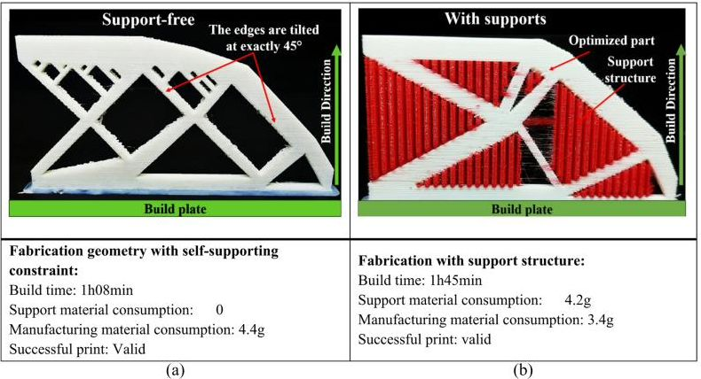

<section class="theory" markdown="1">

## Теоретические сведения
{: .section__title}

Слайсер показывает оценку времени печати и расхода материала. Эти числа получены из самого G-кода: в нем записаны все слои, все отрезки и вся подача нити. Значит, эти показатели можно посчитать самостоятельно — и проверить слайсер.

Такой анализ — обычная часть производства. Программы управления аддитивным производством принимают G-код, показывают сгенерированные команды и послойную разбивку скорости построения, чтобы перед запуском проверить, что файл печатаем. Типичная деталь состоит из тысяч слоев с собственными траекториями, и вручную проверить их невозможно.

</section>

<section class="goal" markdown="1">

## 🎯 Цель работы
{: .section__title}

Научиться:

- извлекать из G-кода число слоев, длину нити, массу материала и длину путей;
- учитывать режимы координат и подачи при разборе файла;
- оценивать время печати и объяснять, почему оценка расходится с оценкой слайсера;
- сравнивать варианты нарезки одной модели по данным G-кода.

</section>

<aside class="callout callout--hint" markdown="1">

⏱ Время и место выполнения
{: .callout__title}

Задания 1 и 2 выполняются на второй встрече и занимают около 15 минут. Итоговое задание в аудиторное время не умещается и выполняется самостоятельно после встречи, около 30 минут.

</aside>

<aside class="callout callout--important" markdown="1">

Модель и слайсер для итогового задания
{: .callout__title}

[PrusaSlicer](https://www.prusa3d.com/page/prusaslicer_424/) — бесплатный слайсер с открытым кодом от Prusa Research: программа, которая нарезает модель на слои, строит траектории и записывает G-код (определение слайсера — [task 1-0](task_1-0.html), раздел 1). Он выбран для занятия потому, что его системные профили для принтеров Prusa пишут обычный текстовый G-код без дуг, который разбирают `stats.py` и просмотрщик, а числа при одинаковых профилях воспроизводятся. [OrcaSlicer](https://github.com/SoftFever/OrcaSlicer) — родственная программа с тем же устройством настроек; им тоже можно пользоваться, если в настройках печати выключить аппроксимацию дугами («Arc fitting»), но профили и числа будут другими.

Итоговое задание выполняется на модели [t\_bracket.stl](../assets/files/t_bracket.stl): Т-образный кронштейн, стойка 12 × 12 × 18 мм и полка 36 × 12 × 4 мм со свесами по 12 мм. Нарезайте ее в [PrusaSlicer](https://www.prusa3d.com/page/prusaslicer_424/) с профилями принтера «Original Prusa i3 MK3S & MK3S+», печати «0.20mm QUALITY @MK3» и материала «Prusament PLA».

Если PrusaSlicer установить нельзя, возьмите готовые файлы, нарезанные с этими профилями в PrusaSlicer 2.8.1: [t\_bracket\_a.gcode](../assets/files/t_bracket_a.gcode) (без поддержек) и [t\_bracket\_b.gcode](../assets/files/t_bracket_b.gcode) (с поддержками). Сохраните их под именами `variant_a.gcode` и `variant_b.gcode`; оценки слайсера записаны в комментариях в конце каждого файла, строки `; estimated printing time` и `; filament used`.

</aside>

<!-- ===================== 1 ===================== -->

<section class="subsection" id="s1" markdown="1">

## <span class="subsection__num">1.</span> Что можно извлечь из G-кода
{: .subsection__title}

| Показатель | Как считается | Что нужно учесть |
|---|---|---|
| число слоев | число разных значений Z у рабочих ходов | подъемы без печати слоем не считаются |
| длина нити | сумма приращений `E` у рабочих ходов | режимы `M82` / `M83`, обнуление `G92 E0` |
| масса | длина нити · сечение нити · плотность | единицы: мм³ → см³ → г |
| путь печати | сумма длин рабочих ходов в плоскости XY | координаты при `G90` / `G91` |
| холостые ходы | сумма длин перемещений без подачи | `G28` возвращает оси в ноль |

<div class="definition" markdown="1">

<span class="definition__term">Модальное значение</span> — параметр, который действует, пока его не изменят. В G-коде модальны режимы (`G90`, `M83` и другие), скорость `F` и координаты: строка без `X` оставляет сопло на прежнем X.

</div>

Масса материала — это объем поданной нити, умноженный на плотность. Для PLA в примерах используется плотность 1,24 г/см³ из технического паспорта Prusament PLA.

</section>

<!-- ===================== 2 ===================== -->

<section class="subsection" id="s2" markdown="1">

## <span class="subsection__num">2.</span> Разбор программы статистики
{: .subsection__title}

- [stats.py](../assets/files/stats.py){: .files__link}
{: .files}

<article class="example" markdown="1">

### Пример 1. Статистика файла G-кода
{: .example__title}

Файл `stats.py`:


import math
import sys

def gcode_stats(path, d_fil=1.75, rho=1.24):    # rho — плотность PLA, г/см³ (паспорт Prusament PLA)
    rel_xyz, rel_e = False, False
    x = y = z = e = 0.0
    e_sum = ext_len = trav_len = 0.0
    zs, arcs = set(), 0
    for raw in open(path, encoding="utf-8", errors="ignore"):
        s = raw.split(";", 1)[0].strip()        # отрезаем комментарий
        if not s:
            continue
        words = s.split()
        cmd, a = words[0].upper(), {}
        for w in words[1:]:
            try:
                a[w[0].upper()] = float(w[1:])
            except ValueError:
                pass
        if cmd == "G90":   rel_xyz, rel_e = False, False
        elif cmd == "G91": rel_xyz, rel_e = True, True   # Marlin: G91 касается и E
        elif cmd == "M82": rel_e = False
        elif cmd == "M83": rel_e = True
        elif cmd == "G92":
            x, y, z, e = a.get("X", x), a.get("Y", y), a.get("Z", z), a.get("E", e)
        elif cmd == "G28":
            x = y = z = 0.0
        elif cmd in ("G2", "G3", "G02", "G03"):  # дуги не разбираются, только считаются
            arcs += 1
        elif cmd in ("G0", "G1"):
            if rel_xyz:
                nx, ny, nz = x + a.get("X", 0), y + a.get("Y", 0), z + a.get("Z", 0)
            else:
                nx, ny, nz = a.get("X", x), a.get("Y", y), a.get("Z", z)
            de = 0.0
            if "E" in a:
                de = a["E"] if rel_e else a["E"] - e
                e = e + a["E"] if rel_e else a["E"]
            L = math.hypot(nx - x, ny - y)
            if de > 0 and L > 0:
                e_sum += de; ext_len += L; zs.add(round(nz, 3))
            elif L > 0:
                trav_len += L
            x, y, z = nx, ny, nz
    if arcs:
        print(f"ВНИМАНИЕ: {path}: дуги G2/G3 не учтены ({arcs} шт.), нить и путь занижены",
              file=sys.stderr)
    mass = e_sum * math.pi * (d_fil / 2) ** 2 / 1000 * rho   # мм³ → см³ → г
    return {"слоев": len(zs), "нить, мм": round(e_sum, 1), "масса, г": round(mass, 2),
            "путь печати, м": round(ext_len / 1000, 2), "холостые, м": round(trav_len / 1000, 2)}

if __name__ == "__main__":
    for p in sys.argv[1:]:
        print(p, gcode_stats(p))


```text
> @@python stats.py square.gcode scaffold.gcode@@
square.gcode {'слоев': 10, 'нить, мм': 89.9, 'масса, г': 0.27, 'путь печати, м': 2.7, 'холостые, м': 0.62}
scaffold.gcode {'слоев': 20, 'нить, мм': 59.9, 'масса, г': 0.18, 'путь печати, м': 1.8, 'холостые, м': 0.59}
```
{: .output}

<div class="analysis" markdown="1">

Разбор
{: .analysis__title}

- Комментарий отрезается до разбора: `raw.split(";", 1)[0]`. Каждое слово строки после команды превращается в пару «буква — число» словаря `a`.
- Флаги `rel_xyz` и `rel_e` хранят режимы. `G90` и `G91` переключают оба флага, `M82` и `M83` — только подачу. `G92` присваивает текущей позиции значение, `G28` возвращает оси в ноль.
- Для `G0` и `G1` вычисляются новая позиция и приращение подачи `de`: в относительном режиме это само число после `E`, в абсолютном — разность с предыдущим значением.
- Отрезок с положительной подачей и ненулевой длиной — рабочий ход: его длина и подача суммируются, высота Z попадает в множество `zs`. Остальные перемещения в плоскости — холостые.
- Втягивание нити (ретракт, [task 1-1](task_1-1.html), раздел 1) записывается строкой `G1 E-0.8` без `X` и `Y`, возврат нити — строкой `G1 E0.8`. Длина такого перемещения в плоскости равна нулю, поэтому ни один из них не попадает в сумму. Отрицательные приращения `E` во время движения тоже не суммируются: условие `de > 0` относит такой отрезок к холостым ходам.
- Дуги `G2` и `G3` программа не разбирает, а только считает. Если они в файле есть, длина нити и путь получаются заниженными, и программа печатает предупреждение. Поэтому в итоговом задании аппроксимация дугами в слайсере выключается.
- Масса: длина нити, умноженная на площадь сечения нити, дает объем в мм³; деление на 1000 переводит его в см³.
- Числа совпадают со статистикой встроенного просмотрщика: он считает по тем же правилам.

</div>

</article>

<article class="task" id="task-1" markdown="1">

### Задание 1. Таблица по двум файлам <span class="level level--2">Уровень 2 · понимание</span>
{: .task__title}

Файл: <span class="task__file">task\_1-6\_1.py</span>
{: .task__meta}

Импортируйте `gcode_stats` из `stats.py` и выведите таблицу для файлов `square.gcode` и `scaffold.gcode` из [task 1-4](task_1-4.html):

```text
файл             слоев  нить, мм  масса, г
square.gcode        10      89.9      0.27
scaffold.gcode      20      59.9      0.18
```
{: .output data-label="Требуемый вывод"}

Столбцы выровнены f-строками с шириной поля: 16, 6, 10 и 10 символов.


from stats import gcode_stats

# заголовок и две строки таблицы; ключи словаря: "слоев", "нить, мм", "масса, г"

файл             слоев  нить, мм  масса, г
square.gcode        10      89.9      0.27
scaffold.gcode      20      59.9      0.18


</article>

<article class="task" id="task-2" markdown="1">

### Задание 2. Оценка времени <span class="level level--3">Уровень 3 · применение</span>
{: .task__title}

Файл: <span class="task__file">task\_1-6\_2.py</span>
{: .task__meta}

Напишите функцию `print_time(path)`, которая оценивает время перемещений: для каждого отрезка `G0` или `G1` с ненулевой длиной в плоскости XY время равно длине, деленной на скорость. Скорость `F` модальна и задана в мм/мин ([task 1-1](task_1-1.html), раздел 4).

```text
square.gcode: 1.8 мин без учета разгона и торможения
scaffold.gcode: 1.1 мин без учета разгона и торможения
```
{: .output data-label="Требуемый вывод"}


import math


def print_time(path):
    # сумма длина / скорость по отрезкам G0 и G1; F модальна, в мм/мин
    pass


print_time("square.gcode")
print_time("scaffold.gcode")

square.gcode: 1.8 мин без учета разгона и торможения
scaffold.gcode: 1.1 мин без учета разгона и торможения


<div class="quiz" data-file="task_1-6_2.py" data-comment="#">
<p class="quiz__title">Вопрос к заданию</p>
<p class="quiz__intro">После верного ответа скопируйте комментарий в конец файла <code>task_1-6_2.py</code>.</p>
<div class="quiz__q">
<p>1. Почему реальная печать займет больше времени, чем эта оценка?</p>
<label><input type="radio" data-ok> На каждом повороте головка тормозит и снова разгоняется, а заданную скорость F набирает не сразу; команды M190 и M109 ждут нагрева без движения; подъемы по Z и втягивание нити в оценку не вошли.</label>
<label><input type="radio"> Принтер выполняет каждую строку G-кода дважды: сначала проверяет, потом печатает.</label>
<label><input type="radio"> Скорость F в файле задана в мм/с, а программа считает ее в мм/мин.</label>
<p class="quiz__exp" hidden>Оценка учитывает только равномерное движение по XY; разгон, торможение, ожидание нагрева и перемещения по Z добавляют минуты (task 1-0, раздел 4; task 1-1, раздел 4).</p>
</div>
<div class="quiz__bar"><button type="button" class="tool-btn tool-btn--main quiz__check">Проверить</button><span class="quiz__status"></span></div>
<div class="quiz__result" hidden><p>Комментарий для вставки в файл:</p><pre class="quiz__comment"></pre><div class="quiz__bar"><button type="button" class="tool-btn quiz__copy">Скопировать</button><span class="quiz__copied"></span></div></div>
</div>

</article>

</section>

<!-- ===================== 3 ===================== -->

<section class="subsection" id="s3" markdown="1">

## <span class="subsection__num">3.</span> Как это выглядит в реальном эксперименте
{: .subsection__title}

В исследовании Antar et al. (2026) консольную балку, спроектированную методом топологической оптимизации, напечатали двумя способами: в самоподдерживающейся форме с ребрами под 45° и в исходной форме с поддержками. Обе детали печатались методом FDM (fused deposition modeling — моделирование наплавлением, то есть экструзионная печать) из PLA с одинаковыми параметрами; G-код получен из STL-файлов слайсером IdeaMaker.

<figure class="figure-src">

<figcaption class="figure-src__caption">(a) Без поддержек: 1 ч 08 мин, 4,4 г материала. (b) С поддержками: 1 ч 45 мин, 4,2 г поддержек и 3,4 г детали.<br>Источник: Antar I. et al., Int. J. Adv. Manuf. Technol., 2026, 143:163–182, Fig. 15, p. 177.</figcaption>
</figure>

<div class="analysis" markdown="1">

Разбор
{: .analysis__title}

- Без поддержек печать заняла на 37 минут меньше — это 35 % от времени печати с поддержками.
- В варианте с поддержками больше половины материала — 4,2 г из 7,6 г — уходит в поддержки, которые затем удаляют.
- Все это можно было узнать до печати, из G-кода двух вариантов: так же вы сравните свои варианты в итоговом задании.

</div>

</section>

<!-- ===================== 4 ===================== -->

<section class="subsection" id="s4" markdown="1">

## <span class="subsection__num">4.</span> Просмотрщик
{: .subsection__title}

Откройте свои файлы кнопкой «Открыть файл…». Статистика под картинкой должна совпасть с результатом `stats.py`.



</section>

<!-- ===================== ИТОГОВОЕ ===================== -->

<section class="section" id="slicer" markdown="1">

## Как нарезать модель в PrusaSlicer
{: .section__title}

Порядок действий для тех, кто открывает слайсер впервые. Названия даны парами: русский / английский, потому что язык интерфейса зависит от установки. При установке лучше выбрать английский язык: с ним совпадают названия в справке Prusa и в большинстве видео, а поиск по настройкам находит параметры по английским именам.

1. Установите PrusaSlicer с [сайта программы](https://www.prusa3d.com/page/prusaslicer_424/). При первом запуске откроется «Мастер настройки / Configuration Wizard»; если его закрыли, вызовите заново: **Настройки → Мастер настройки / Configuration → Configuration Wizard**.
1. На шаге «Источники конфигураций / Configuration sources» оставьте отмеченным только «Prusa FFF» (FFF, fused filament fabrication — экструзионная печать нитью); остальные источники снимите.
1. На шаге «Prusa Research» в семействе принтеров MK3 отметьте «Original Prusa i3 MK3S & MK3S+» с соплом 0,4 мм; другие принтеры и альтернативные сопла не нужны.
1. На шаге «Настройки прутка / Filaments» отметьте «Prusament PLA» (производитель Prusa Polymers); другие профили можно снять. Шаги «Обновления / Updates», «Загрузки / Downloads», «Перезагрузить с диска / Reload from disk», «Ассоциация файлов / File associations» оставьте по умолчанию, в «Режиме просмотра / View mode» выберите «Продвинутый / Expert» и нажмите «Завершить / Finish».
1. Перетащите файл `t_bracket.stl` в окно программы или откройте его через **Файл → Импорт → Загрузить STL/3MF/STEP/OBJ/AMF… / File → Import → Import STL/3MF/STEP/OBJ/AMF…** (<kbd>Ctrl</kbd>+<kbd>I</kbd>). Модель появится на столе.
1. На правой панели проверьте профили: «Профиль печати / Print settings» — «0.20mm QUALITY» (по умолчанию может стоять «0.15mm QUALITY»: смените), «Профиль прутка / Filament» — «Prusament PLA», «Профиль принтера / Printer» — «Original Prusa i3 MK3S & MK3S+».
1. Переключатель режима в правом верхнем углу должен стоять в положении «Продвинутый / Expert mode»: иначе часть настроек скрыта. Найдите через поиск по настройкам (<kbd>Ctrl</kbd>+<kbd>F</kbd>) параметры «Arc fitting» (Настройки печати → Дополнительно / Print Settings → Advanced) и «Supports binary G-code» (Настройки принтера → Общие / Printer Settings → General): первый должен быть «Отключено / Disabled», второй не отмечен. Для профиля MK3S это значения по умолчанию.
1. В поле «Поддержка / Supports» на правой панели выберите «Нет / None» для варианта А или «Везде / Everywhere» для варианта Б. Поле «Infill» (плотность заполнения) оставьте 15 %.
1. Нажмите «Нарезать / Slice now» (<kbd>Ctrl</kbd>+<kbd>R</kbd>). Внизу появятся оценка времени печати и расход материала: запишите их. Ползунком справа можно просмотреть слои: дорожки контура, заполнения и поддержек показаны разными цветами.
1. Нажмите «Экспорт G-кода / Export G-code» (<kbd>Ctrl</kbd>+<kbd>G</kbd>) и сохраните файл под именем из задания. Для второго варианта повторите шаги 8–10.

Подробнее о программе: статьи базы знаний Prusa на английском ([help.prusa3d.com/category/prusaslicer](https://help.prusa3d.com/category/prusaslicer_204)); на русском цикл статей «PrusaSlicer» на 3deshnik.ru ([«Начало»](https://3deshnik.ru/blogs/dark184/prusaslicer-nachalo), [«Нарезка модели»](https://3deshnik.ru/blogs/dark184/prusaslicer-narezka-modeli)). Видео: на английском [PrusaSlicer Beginner Tutorial](https://www.youtube.com/watch?v=_kIqMPNQNSw) (3D Rev), на русском [обзор PrusaSlicer](https://www.youtube.com/watch?v=oaObq1L7h-U) (снят для версии 2.0; расположение настроек с тех пор почти не изменилось).

</section>

<section class="final-task" id="final" markdown="1">

## Итоговое задание: два варианта одной модели <span class="level level--5">Уровень 5 · итоговое</span>

Файлы: <span class="task__file">variant\_a.gcode</span>, <span class="task__file">variant\_b.gcode</span>, <span class="task__file">task\_1-6\_compare.py</span>, <span class="task__file">task\_1-6\_report.txt</span>
{: .task__meta}

**Ситуация.** Нужно решить, как печатать кронштейн: с поддержками под полкой или без них. Решение принимается до печати, по данным G-кода.

**Требования:**

1. Скачайте модель [t\_bracket.stl](../assets/files/t_bracket.stl) и откройте ее в PrusaSlicer с профилями из выноски в начале страницы. Перед нарезкой найдите в настройках (поиск по настройкам: <kbd>Ctrl</kbd>+<kbd>F</kbd>) параметры «Arc fitting» и «Supports binary G-code»: первый должен быть выключен (Disabled), второй не отмечен. Иначе файл будет содержать дуги `G2`/`G3` или окажется двоичным, и `stats.py` не сможет его разобрать.
1. Нарежьте модель два раза, меняя только поддержки (поле «Supports» на правой панели): `variant_a.gcode` — значение «None», `variant_b.gcode` — значение «Everywhere». Запишите оценку времени и расхода материала, которую показывает слайсер для каждого варианта. Если PrusaSlicer недоступен, используйте готовые файлы из выноски.
1. Программа <span class="task__file">task\_1-6\_compare.py</span> выводит для обоих файлов число слоев, длину нити, массу, путь печати, холостые ходы и оценку времени из задания 2, а также отношение масс варианта Б к варианту А. Если программа напечатала предупреждение о дугах, нарежьте модель заново.
1. Откройте оба файла в просмотрщике и сверьте статистику с выводом программы по блоку ниже.
1. В файле <span class="task__file">task\_1-6\_report.txt</span> ответьте: какой вариант быстрее и экономнее и на сколько процентов; насколько ваша оценка времени отличается от оценки слайсера и почему; почему у варианта Б «слоев» больше, чем у варианта А, хотя высота детали одна и та же (посмотрите в просмотрщике высоты Z слоев с поддержками); согласуется ли ваш результат с экспериментом Antar et al. (раздел 3).

<div class="check" markdown="1">

Проверьте себя
{: .check__title}

Числа ниже получены для готовых файлов со страницы (PrusaSlicer 2.8.1). Если вы нарезали модель сами в другой версии, допустимо отклонение в несколько процентов; важно, чтобы вывод программы совпал со статистикой просмотрщика и с массой по слайсеру.

| Показатель | Значение | Если не совпало |
|---|---|---|
| Слоев, А / Б | 110 / 180 | разная высота слоя; у Б больше слоев из-за поддержек, это не ошибка |
| Нить E, мм, А / Б | 937,2 / 1464,2 | в файле дуги G2/G3 или другой профиль |
| Масса, г, А / Б | 2,80 / 4,37 | плотность не 1,24 г/см³ |
| Время перемещений, мин, А / Б | 20,3 / 24,4 | скорость F не переведена из мм/мин |
| Предупреждения | нет | файл с дугами: нарежьте заново |

</div>

Файлы G-кода этой модели занимают около 0,5 МБ каждый и сдаются целиком.

<aside class="callout callout--hint" markdown="1">

Вариант с учебным слайсером
{: .callout__title}

Если PrusaSlicer недоступен, а готовые файлы вы уже разобрали, выполните задание на [учебном слайсере](../slicer.html) курса: он не строит поддержки, поэтому сравниваются два заполнения. Нарежьте кронштейн с плотностью 20 % и 80 % при остальных параметрах по умолчанию, скачайте файлы как `variant_a.gcode` и `variant_b.gcode` и выполните пункты 3–5; в отчете вместо поддержек обсуждайте заполнение, а в сравнении с Antar et al. укажите, что здесь меняется не опора, а внутренняя структура детали. Контрольные числа: 110 слоев в обоих файлах; нить 809,4 и 1612,5 мм; путь печати 24,34 и 48,48 м; холостые 3,87 и 3,93 м. Слайсер [Kiri:Moto](../kiri.html) умеет строить поддержки, и на нем можно повторить исходное сравнение; его числа будут отличаться от PrusaSlicer.

</aside>

</section>

<!-- ===================== ЗАТЕМ ===================== -->

<section class="then" markdown="1">

## Затем
{: .then__title}

1. Внутри папки `pipeline_1` создайте папку `task_1_6`.
1. Переместите в нее копию `stats.py`, программы и файлы этой страницы: <span class="task__file">task\_1-6\_1.py</span>, <span class="task__file">task\_1-6\_2.py</span>, <span class="task__file">task\_1-6\_compare.py</span>, <span class="task__file">task\_1-6\_report.txt</span>, <span class="task__file">variant\_a.gcode</span> и <span class="task__file">variant\_b.gcode</span>.
{: .steps}

Итоговая структура папок должна выглядеть так:

```text
ivanov_ii/
└── pipeline_1/
    ├── task_1_1/
    ├── task_1_2/
    ├── task_1_3/
    ├── task_1_4/
    ├── task_1_5/
    └── @@task_1_6/@@
        ├── stats.py
        ├── task_1-6_1.py
        ├── task_1-6_2.py
        ├── task_1-6_compare.py
        ├── task_1-6_report.txt
        ├── variant_a.gcode
        └── variant_b.gcode
```
{: .folder-tree}

</section>

<section class="section sources" markdown="1">

## Источники
{: .section__title}

1. Gibson I., Rosen D., Stucker B., Khorasani M. Additive Manufacturing Technologies. 3rd ed. Springer, 2021 — п. 6.2.5 (разгон и торможение головки), п. 17.4 и 17.10 (программы предпросмотра и управления производством, p. 504, 518–519).
1. Leary M. Design for Additive Manufacturing. Elsevier, 2020 — п. 3.3.6 (p. 75): тысячи уникальных слоев.
1. Antar I., Al Nahari B., Zarbane K., El Oumami M. An enhanced topology optimization method for the additive manufacturing of self-supporting structures. Int. J. Adv. Manuf. Technol., 2026, 143:163–182. DOI (digital object identifier, цифровой идентификатор публикации): [10.1007/s00170-025-17252-6](https://doi.org/10.1007/s00170-025-17252-6) — п. 5, Fig. 15 (p. 175–177). Исправление к статье (DOI: 10.1007/s00170-026-17889-x) касается формул и табл. 4 и рисунок 15 не затрагивает.
1. Prusa Polymers. Technical datasheet Prusament PLA, v1.1, 2022 — плотность 1,24 г/см³.
1. PrusaSlicer 2.8.1: встроенная справка по параметрам (`prusa-slicer --help-fff`): `arc_fitting`, `binary_gcode`, `retract_length`, `support_material`; системные профили Prusa Research (Original Prusa i3 MK3S & MK3S+, 0.20mm QUALITY @MK3, Prusament PLA). Сайт программы: [prusa3d.com/page/prusaslicer\_424](https://www.prusa3d.com/page/prusaslicer_424/).
{: .sources__list}

</section>
